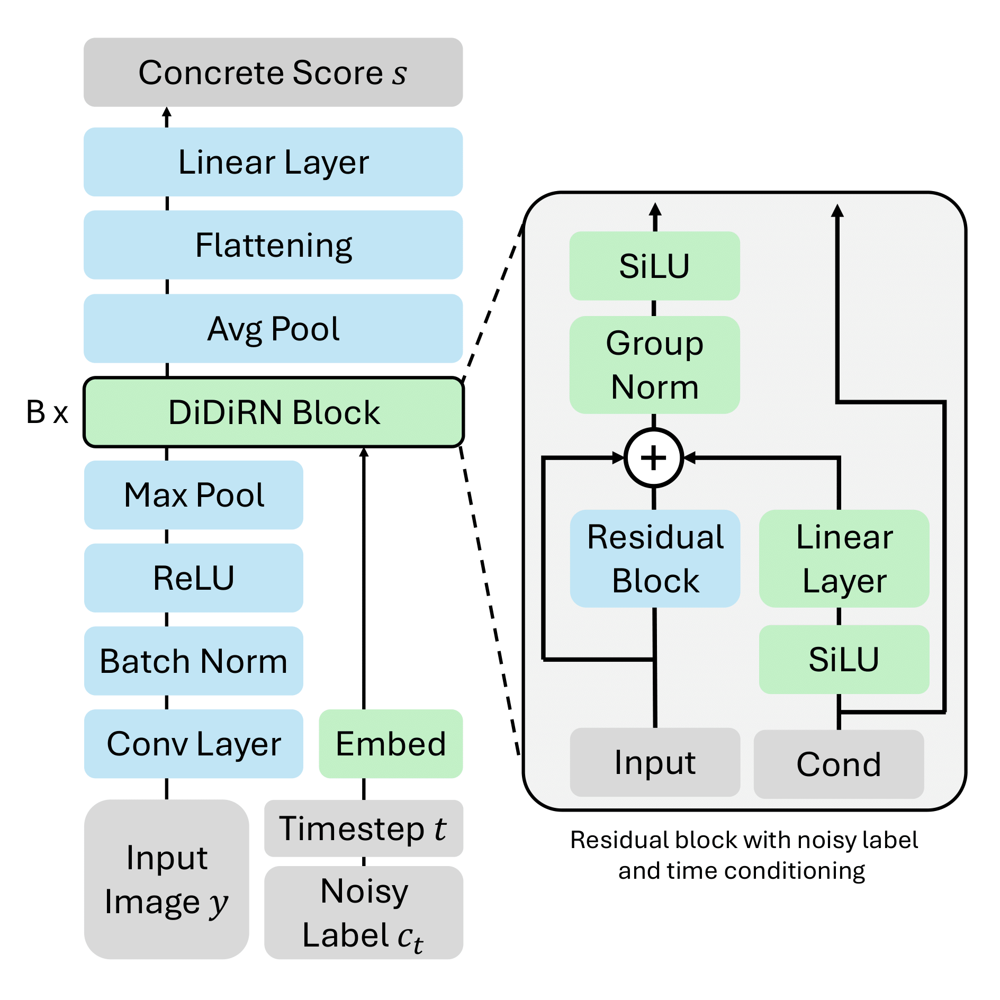

# Advancing Image Classification with Discrete Diffusion Classification Modeling

This repository contains the official implementation of our DiDiCM paper: *"Advancing Image Classification with Discrete Diffusion Classification Modeling"* ([arxiv](https://arxiv.org/abs/2511.20263)).

<p align="center">
  
</p>

The training and validation scripts are based on [timm's repository](https://github.com/huggingface/pytorch-image-models/tree/main) and have been adapted to work with our DiDiCM approach.

## Data Preparation

Download and organize ImageNet with the following folder structure:

```
│imagenet/
├──train/
│  ├── n01440764
│  │   ├── n01440764_10026.JPEG
│  │   ├── n01440764_10027.JPEG
│  │   ├── ......
│  ├── ......
├──val/
│  ├── n01440764
│  │   ├── ILSVRC2012_val_00000293.JPEG
│  │   ├── ILSVRC2012_val_00002138.JPEG
│  │   ├── ......
│  ├── ......
```

To download the dataset:

```bash
# Training set
wget https://image-net.org/data/ILSVRC/2012/ILSVRC2012_img_train.tar --no-check-certificate
# Validation set
wget https://image-net.org/data/ILSVRC/2012/ILSVRC2012_img_val.tar --no-check-certificate
```

To extract the downloaded files, use this [script](https://gist.github.com/BIGBALLON/8a71d225eff18d88e469e6ea9b39cef4).

## Training

We present the DiDiRN architecture:

<p align="center">
  
</p>

The DiDiRN architecture is built upon the ResNet design for a fair comparison and is therefore available in all comparable variants: DiDiRN-18, DiDiRN-34, DiDiRN-50, DiDiRN-101, and DiDiRN-152.

Additionally, we adopt two training regimes. The first, referred to as *Weak Aug*, consists of the standard image augmentations used for the ImageNet dataset as implemented in PyTorch. The second, denoted *Strong Aug*, employs a more advanced, state-of-the-art augmentation pipeline for ResNet models, following the ResNet-SB paper.

To train the **DiDiRN-50** model with the **Strong Aug** recipe on 8 GPUs, run:

```bash
torchrun --nproc-per-node=8 train.py --data-dir <DATA_PATH> --data-ratio <RATIO> --input-size 3 <RES> <RES> --amp --model=didirn50 --diffusion-enabled -b=256 --epochs=600 --warmup-epochs=5 --opt=lamb --weight-decay=0.01 --sched=cosine --lr=3.5e-3 -j=16 --reprob=0.0 --remode=pixel --mixup=0.2 --cutmix=1.0 --aug-repeats 3 --aa=rand-m7-mstd0.5-inc1
```

To train the **DiDiRN-50** model with the **Weak Aug** recipe on 8 GPUs, run:

```bash
torchrun --nproc-per-node=8 train.py --data-dir <DATA_PATH> --data-ratio <RATIO> --input-size 3 <RES> <RES> --amp --model=didirn50 --diffusion-enabled -b=128 --epochs=600 --warmup-epochs=5 --opt=lamb --weight-decay=0.01 --sched=cosine --lr=2e-3  -j=16
```

Replace `<DATA_PATH>` with the path to your ImageNet data folder, `<RATIO>` with the training data ratio to use (0 to 1), and `<RES>` with the desired image resolution (224 for standard training).

*Note*: For the Weak Aug recipe, we use the square-root scaling rule: $\text{lr} = \text{base} \times \sqrt{1/\text{ratio}}$.

For additional training recipes and models, please refer to [timm's repository](https://github.com/huggingface/pytorch-image-models/tree/main).

## Validation

In our paper, we introduced two variants of diffusion simulation: *DiDiCM-CP*, which operates on class probabilities, providing higher computational efficiency at the expense of increased memory usage, and *DiDiCM-CL*, which works with class labels and is therefore more memory-efficient.

To perform validation, run:

```bash
python validate.py --data-dir <DATA_PATH> --img-size <RES> --crop-pct 0.875 -b=512 --amp --model=didirn50 --checkpoint <CHECKPOINT_PATH> --diffusion-enabled --diffusion-sampler=<SAMPLER> --diffusion-steps=<STEPS>
```

Replace `<DATA_PATH>` with the path to your ImageNet data directory, `<RES>` with the trained image resolution, `<CHECKPOINT_PATH>` with the path to the model checkpoint (a `.pth.tar` file), `<SAMPLER>` with either "cp" or "cl", and `<STEPS>` with the number of diffusion steps you wish to use.

## Citation

```bibtex
@article{belhasin2025advancing,
  title={Advancing Image Classification with Discrete Diffusion Classification Modeling},
  author={Belhasin, Omer and Golan, Shelly and El-Yaniv, Ran and Elad, Michael},
  journal={arXiv preprint arXiv:2511.20263},
  year={2025}
}
```
